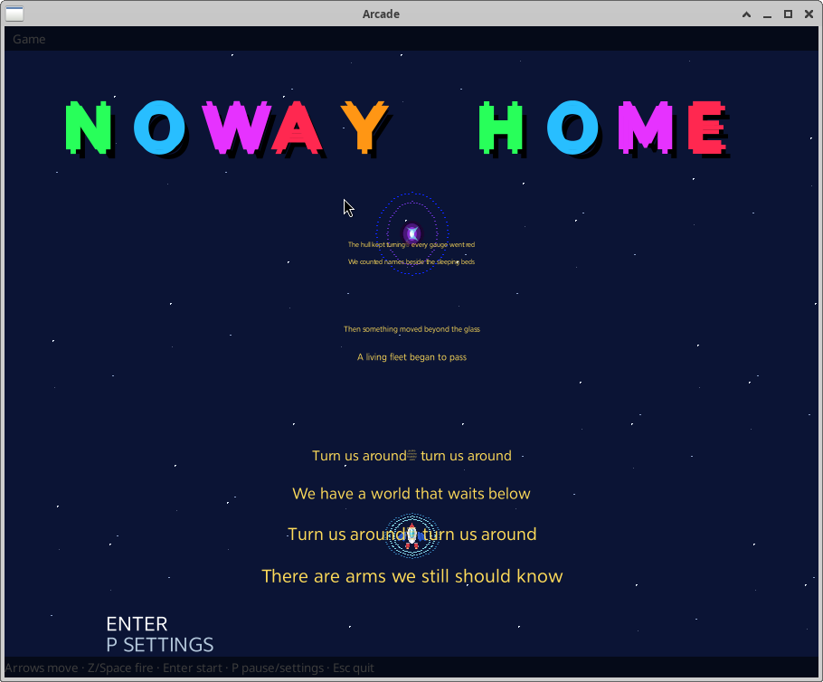
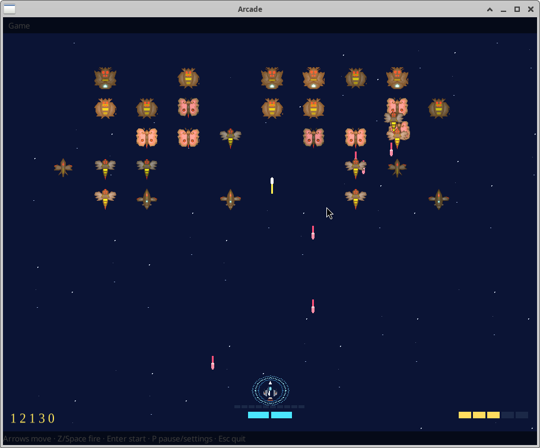
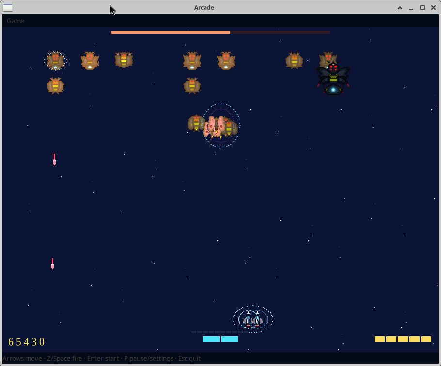

# Arcade

#Bug Fixed in Fire control !!!!! now working reliably. 

Arcade is a collection of fast, lightweight 2D games made with the AILANG
programming language. **NOWAY HOME** is the first game, with more titles
planned for the same engine and host.

AILANG compiles to bare-metal x86_64 using a full self-hosting compiler written
from the ground up for optimized code generation. The language and toolchain
are designed to make programs easy to read, reason about, and generate with the
help of large language models.

## NOWAY HOME

A hive has captured a carrier near Earth and is using the fleet for food. You
are a fighter left behind. Defeat ten queens, recover the hyperdrive, and get
home.

The game includes:

- Side-to-side fighter movement and shooting
- Enemy formations, diving attacks, and formation fire
- Captures that can be reversed by destroying the captor
- Ten increasingly difficult queen battles
- Drive-part pickups, shields, extra lives, and score bonuses
- Music, sound effects, and an attract screen







## How it works

The game is written in AILANG and compiled for x86_64. A small GTK host
provides the desktop window, keyboard input, resizing, and audio support,
while the compiled game handles the game logic and drawing.

The playfield expands to fill the window. Vector artwork is rasterized for the
current window size, helping sprites stay sharp when the window is resized.


## Performance

In testing on an AMD FX-8370 system with 64 GB of RAM at 3.2 GHz, the game used
3–5% CPU and 9–20 MB of memory. A 1024×1024 window typically used 9–11 MB;
larger windows use more memory because the framebuffer grows with the window
size.

## Development

The game engine and NOWAY HOME were developed from start to finish in two work
days, followed by a week of post-production testing and a final four-hour
session of tweaks and improvements based on feedback.

## Repository layout

```text
arcade_app.ailang     Application entry point
App/                  Shared engine code
Game/                 Game modules
assets/               Artwork, sound effects, and music
fonts/                Game fonts
host/                 GTK window and audio host
scripts/              Run and installation scripts
noway-home/           NOWAY HOME screenshots
```

## Run

```bash
./scripts/run_arcade.sh
```

You need `ailang.x` on your `PATH` and GTK3 installed. `ailang.x` is provided
by [Ailang-Self-Hosting](https://github.com/AiLang-Author/Ailang-Self-Hosting).

| Key | Action |
|-----|--------|
| ← → | Move |
| z / Space | Fire |
| Enter | Start or continue |
| p | Pause and settings |
| Esc / q | Quit |

To add a desktop launcher on Linux:

```bash
./scripts/install_desktop.sh
```

## Haiku

The Haiku window host is maintained in a separate repository:

https://github.com/AiLang-Author/Haiku-Arcade

Clone it next to this repository so its shared-file links can find `assets/`,
`fonts/`, and `arcade_app.x`. See that repository's instructions for building
and installing the Haiku version.

## Adding games

Arcade is designed to support more than one game. A new title can be added
under `Game/` and reuse the shared window, entity, formation, starfield, font,
and effect systems.

Copyright © 2026 Sean Collins, 2 Paws Machine and Engineering. SCSL v1.0.
