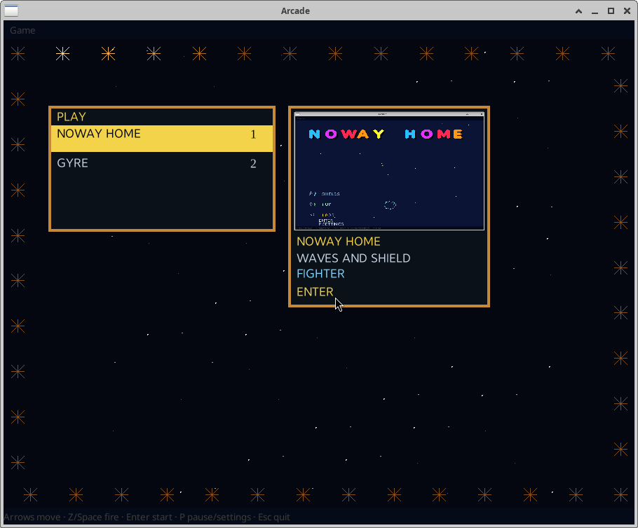

# Arcade

Arcade is a cabinet of fast 2D games written in AILANG. One kernel owns the
pixels. A small GTK host is the window, the keyboard, and the sound. The
cabinet opens on a game list. Two titles are playable: **NOWAY HOME** and
**GYRE**. More games can share this kernel and host. A side scroller is not
in the cabinet yet.

AILANG compiles to bare-metal x86_64. The compiler is self-hosting and is
written so the programs stay readable.

## The cabinet

Up and down move between the games. Enter loads the highlighted one at the
current window size. Resizing on the menu does not load artwork. Resizing
inside a game reloads only that game. Up on a title screen returns to the
list. During play, Up does not leave the game. Pause, then leave, also
returns to the list.

The menu loops `assets/music/Melow This Out.mp3`. NOWAY HOME uses
`Turn Us Around.mp3`. GYRE uses `Iron Clusters.mp3`. The other tracks rotate
during NOWAY HOME stages. Sound effects stay WAV. Music WAV masters are local
only and are not in this repository.

The desktop launcher is named ARCADE. Its icon is the neon cabinet in
`assets/hud/icons`.

## NOWAY HOME

A hive has captured a carrier near Earth and is using the fleet for food. You
are a fighter left behind. Defeat the queens, recover the hyperdrive, and get
home.

- Side-to-side movement and shooting
- Formations, diving attacks, and formation fire
- Captures that can be reversed by destroying the captor
- Queen battles, drive-part pickups, shields, extra lives, and score bonuses




## GYRE

A rim-orbit tube shooter. You turn along the ring while craft come out of the
vanishing point. Every tenth wave is a queen that sits on that point, turns,
and can be hit only through one opening. The star field streams down the
tunnel to the edge of the window.

## How it works

The playfield is a square raster in the window's device pixels. The short side
of the window is a 1024-unit square, centered. Vector artwork is rasterized
once at that size, cached, and reused until the window changes. The host puts
the finished buffer on the window 1:1 with X shared memory, on an 8 ms timer,
so a larger window stays on the pixel grid. Cairo is the fallback when shared
memory is unavailable.

The kernel writes two frame slots and a generation count. The host shows the
slot the kernel is not drawing, and it ignores generation 0 so a leftover
frame from the previous session is not painted at startup.

## Performance

On an AMD FX-8370 with 64 GB of RAM at 3.2 GHz, the game used 3–5% CPU and
9–20 MB of memory. A 1024×1024 window typically used 9–11 MB. Larger windows
use more memory because the framebuffer grows with the window. After the
shared-memory present, a 1280×923 window kept every kernel frame. The kernel
itself is still about a 6 ms frame at 60 Hz.

## Repository layout

```text
arcade_app.ailang     Cabinet entry point
App/                  Shared engine, menu, ring, stars, HUD
Game/                 NOWAY HOME (Galaga) and GYRE
assets/               Artwork, sound effects, and music
fonts/                Game fonts
host/                 GTK window and audio host
scripts/              Run and installation scripts
noway-home/           NOWAY HOME screenshots
```

## Run

```bash
./scripts/run_arcade.sh
```

`./scripts/install_desktop.sh` uses the prebuilt `arcade_app.x` (static) and
`host/arcade_shell_gtk`. On Debian, Ubuntu, and Pop it installs the GTK 3,
Cairo, ALSA, and PulseAudio libraries that host needs, and adds your user to
the `input` group when `/dev/input` is not readable. Log out once if it says
the group is not active yet.

Rebuilding the kernel needs `ailang.x` on your `PATH`, from
[Ailang-Self-Hosting](https://github.com/AiLang-Author/Ailang-Self-Hosting).
Rebuilding the host needs `g++`, `make`, `pkg-config`, and the GTK 3 headers.
The installer adds those compiler packages when the host binary is absent.
Compile from this directory. The imports are relative to the current working
directory.

| Key | Action |
|-----|--------|
| ↑ ↓ | Choose a game on the menu |
| Enter | Load the highlighted game, or start it from the title |
| ↑ on a title | Return to the game list |
| ← → | Move |
| z / Space | Fire |
| p | Pause and settings |
| Esc / q | Quit |

To install the menu and desktop launcher:

```bash
./scripts/install_desktop.sh
```

## Haiku

The Haiku window host is maintained in a separate repository:

https://github.com/AiLang-Author/Haiku-Arcade

Clone it next to this repository so its shared-file links can find `assets/`,
`fonts/`, and `arcade_app.x`. See that repository's instructions for building
and installing the Haiku version.

## Adding a game

A new title lives under `Game/` and is a row in the cabinet (`App/Cab.ailang`).
It can reuse the window, entities, stars, fonts, and effects. The kernel loads
that game's artwork when the player enters it, not at boot.

Copyright © 2026 Sean Collins, 2 Paws Machine and Engineering. SCSL v1.0.
