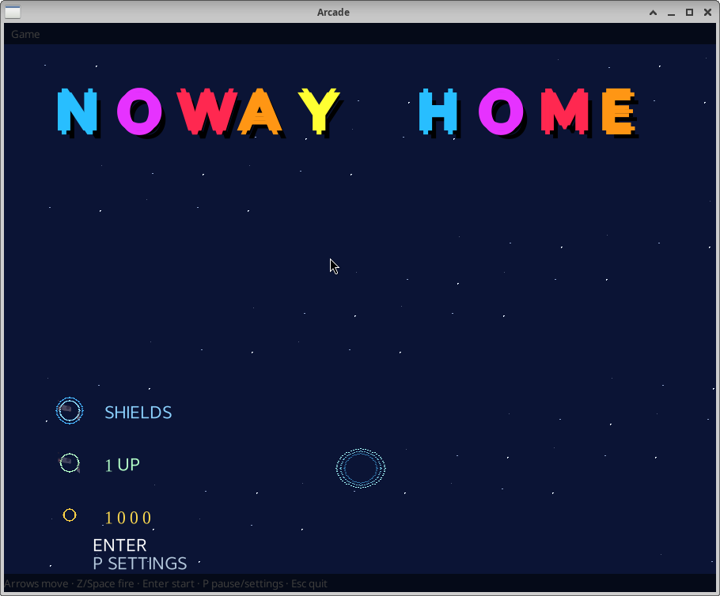
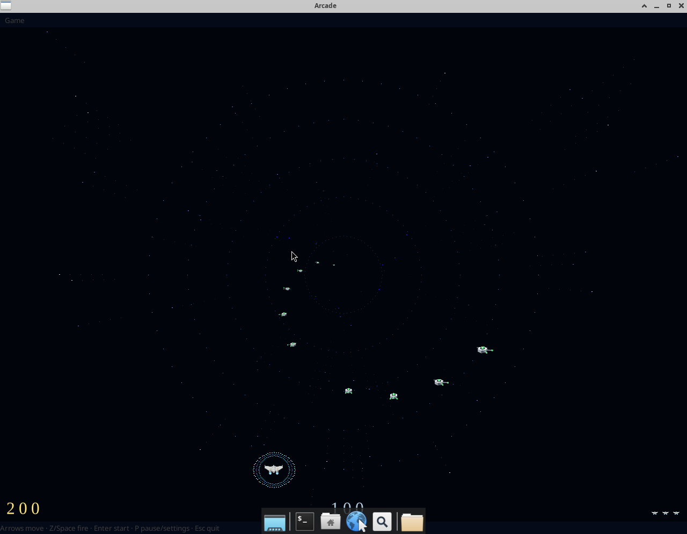
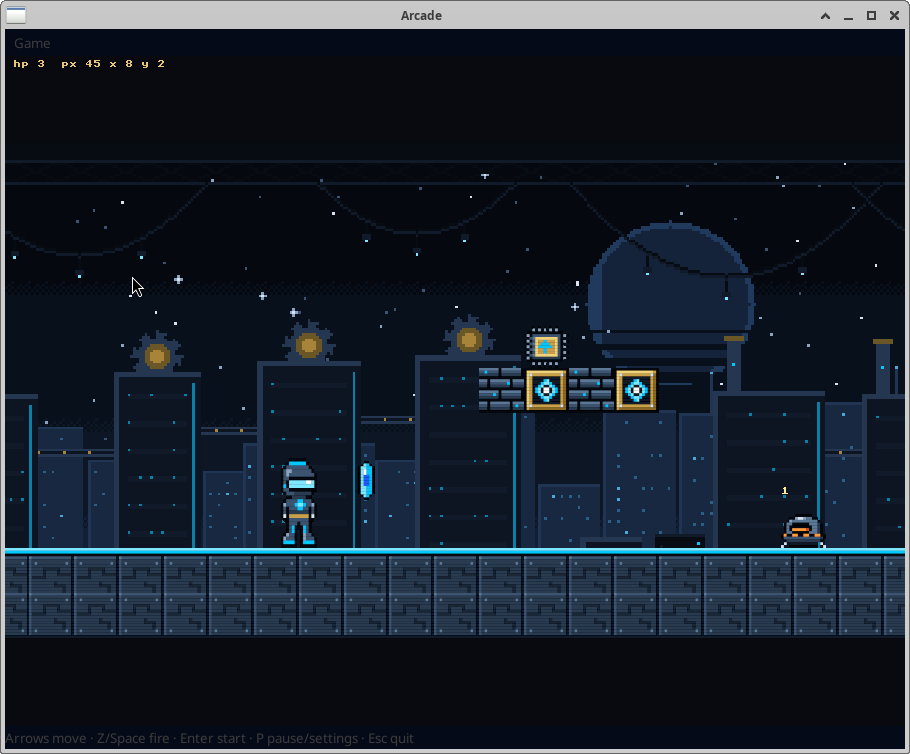
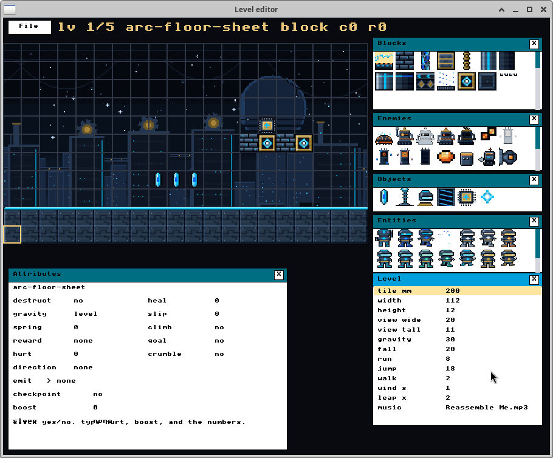

# Arcade

Arcade is a cabinet of fast-paced 2D games built in AiLang, a custom programming language and compiler under active development. This project is part of a broader effort to bootstrap new software in a new language, proving that a self-hosted toolchain can produce working native systems without depending on an existing ecosystem.

A single kernel owns the pixels, while a small GTK host provides the window, keyboard input, and sound. The cabinet opens to a game list with three playable titles: NOWAY HOME, GYRE, and CIRCUIT. NOWAY HOME and GYRE run inside the cabinet program. CIRCUIT is a standalone program. Press Enter on a highlighted row to launch it in the same window, and press Enter on its pause screen to return to the game list.

AiLang compiles to bare-metal x86_64. The compiler is self-hosting and written to keep programs readable while preserving direct access to the machine.

## The cabinet

Use Up and Down to move between games. Press Enter to load the highlighted title at the current window size. Resizing the menu does not load artwork. Resizing inside a game reloads only that game.

On NOWAY HOME and GYRE, pressing Up on the title screen returns to the game list. During play, Up does not leave. Pause, then leave, to return to the list.

CIRCUIT is the third row. Press Enter to start it in the same window. Up jumps. On its pause screen, Enter returns to the list. Press Q or Esc on the cabinet window to quit. CIRCUIT's controls are described in `docs/CIRCUIT.md`.

The menu loops `assets/music/Melow This Out.mp3`. NOWAY HOME uses `Turn Us Around.mp3`, and GYRE uses `Iron Clusters.mp3`. The remaining tracks rotate during NOWAY HOME stages. Sound effects remain WAV, and the music WAV masters are kept local and are not included in this repository.

The desktop launcher is named ARCADE, and its icon is the neon cabinet in `assets/hud/icons`.


## NOWAY HOME

A hive has captured a carrier near Earth and is using the fleet as food. You are a fighter left behind. Defeat the queens, recover the hyperdrive, and get home.

- Side-to-side movement and shooting
- Formations, diving attacks, and formation fire
- Captures that can be reversed by destroying the captor
- Queen battles, drive-part pickups, shields, extra lives, and score bonuses




## GYRE

A rim-orbit tube shooter. You turn along the ring while craft emerge from the vanishing point. Every tenth wave is a queen that sits on that point, turns, and can be hit only through one opening. The star field streams down the tunnel to the edge of the window.



## Circuit

A new 2D side-scroller with a great deal of customization. This is the first title, but feel free to make your own assets and levels.



## Editor

A fairly complete game editor. This and Circuit are the first steps toward a user ecosystem of buildable games: generate assets, lay out levels, and build custom games.



## How it works

NOWAY HOME and GYRE draw a square raster in the window's device pixels. The short side of the window is a 1024-unit square, centered. Vector artwork is rasterized once at that size, cached, and reused until the window changes. Circuit and the level editor fit the level view to the window and cache each picture per cell size. The host puts the finished buffer on the window 1:1 with X shared memory on an 8 ms timer, so a larger window stays on the pixel grid. Cairo is the fallback when shared memory is unavailable.

The kernel writes two frame slots and a generation count. The host shows the slot the kernel is not drawing, and it ignores generation 0 so a leftover frame from the previous session is not painted at startup.


## Performance

On an AMD FX-8370 with 64 GB of RAM at 3.2 GHz, the game used roughly 3–5% CPU and 9–20 MB of memory. A 1024×1024 window typically used 9–11 MB. Larger windows use more memory because the framebuffer grows with the window. After the shared-memory fix, a 1280×923 window kept every kernel frame. The kernel itself is still around a 6 ms frame at 60 Hz.

## Repository layout

```text
arcade_app.ailang     Cabinet entry point
App/                  Shared engine, menu, ring, stars, HUD
Game/                 NOWAY HOME and GYRE
Circuit/              Circuit, the side-scroller
Editor/               Level editor
games/                Side-scroller level files, one folder per game
assets/               Artwork, sound effects, and music
fonts/                Game fonts
host/                 GTK window and audio host
scripts/              Run and installation scripts
docs/                 Circuit, the editor, and the level-file format
screenshots/          Cabinet, game, and editor screenshots
```

## Install

The public repository is [ARCADE](https://github.com/AiLang-Author/ARCADE).

A clone contains `arcade_app.x`, `circuit.x`, and `level_edit.x`. Those three were built by the tree-shaking compiler, which drops unused code. The GTK host, `host/arcade_shell_gtk`, is not in the clone. The installer builds each program that is missing. It builds the three AiLang programs one at a time and does not open a window.

```bash
git clone https://github.com/AiLang-Author/ARCADE.git
cd ARCADE
./scripts/install_desktop.sh
```

This adds two entries to the applications menu and, when a Desktop folder exists, two launchers on the desktop: **ARCADE** and **ARCADE Level Editor**.

On Debian, Ubuntu, and Pop, the script installs the GTK 3, Cairo, ALSA, and PulseAudio libraries the host needs, and the GTK headers when the host binary is absent. It adds your user to the `input` group when `/dev/input` is not readable. Log out once if it says the group is not active yet.

Building the three programs needs `ailang.x` on your `PATH`, from [Ailang-Self-Hosting](https://github.com/AiLang-Author/Ailang-Self-Hosting). Compile from this directory. The imports are relative to the current working directory. If the binaries are already present, the installer leaves them and only writes the menu entries.

`assets/circuit` is a symlink to the Circuit art pack. The link stored in this repository points at the pack on the machine where the city was built. That pack is not in the repository. If the installer warns that the link is empty, point it at your copy and leave `games/circuit` as it is:

```bash
ln -sfn "/path/to/circuit-runner-assets" assets/circuit
```

NOWAY HOME and GYRE do not use that pack. Their pictures are under `assets/`.

## Run

```bash
./scripts/run_arcade.sh
```

- `./scripts/run_circuit.sh` opens Circuit on its own.
- `./scripts/run_editor.sh` opens the level editor.
- The menu entries run `./scripts/launch_arcade.sh` and `./scripts/run_editor.sh`.

| Key | Cabinet menu, NOWAY HOME, and GYRE |
|-----|--------|
| ↑ ↓ | Choose a game on the menu |
| Enter | Load the highlighted game, or start it from the title |
| ↑ on a title | Return to the game list |
| ← → | Move |
| z / Space | Fire |
| p | Pause and settings |
| Esc / q | Quit the cabinet window |

Circuit uses the same key line and different actions. Z and Space jump. X fires. Enter runs. Down crouches. When the cabinet started Circuit, Enter on the pause screen returns to the list. The standalone window does not. The table is in `docs/CIRCUIT.md`. The editor keys are in `docs/EDITOR.md`.

## Haiku

The Haiku window host is maintained in a separate repository:

https://github.com/AiLang-Author/Haiku-Arcade

Clone it next to this repository after `./scripts/install_desktop.sh`, so its shared-file links can find `assets/`, `fonts/`, and `arcade_app.x`. `arcade_app.x` is in this repository. The GTK host is built by the installer and is not stored in git. See that repository's instructions for building and installing the Haiku version.

## Adding a game

A shooter that lives in the cabinet goes under `Game/` and is a row in `App/Cab.ailang`. It can reuse the window, entities, stars, fonts, and effects. The cabinet loads that game's artwork when the player enters it, not at boot. NOWAY HOME and GYRE are those titles.

A side-scroller is its own program, the way Circuit is `circuit.x`. Its levels live in `games/<name>/levels/`. The level editor creates that folder and leaves `games/circuit` in place. It does not add a cabinet row by itself. See `docs/CIRCUIT.md`, `docs/EDITOR.md`, and `docs/LEVEL.md`.

Copyright © 2026 Sean Collins, 2 Paws Machine and Engineering. SCSL v1.0.
